# mico-spinner




Minimalistic spinner for Node.js.

* Only single dependency ([Nano Colors](https://github.com/ai/nanocolors)) without sub-dependencies. In contrast, `ora` has [30 sub-dependencies](https://npm.anvaka.com/#/view/2d/ora).
* Detects Unicode and color support in terminal.

## Usage

```js
let micoSpinner = require('mico-spinner')

let spinner = micoSpinner('Long task').start()
try {
  await longTask()
  spinner.succeed()
} catch (e) {
  spinner.fail()
  console.error(e.stack)
}
```
